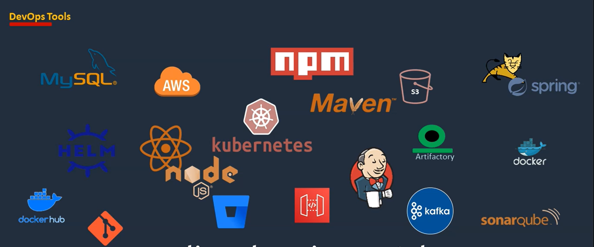
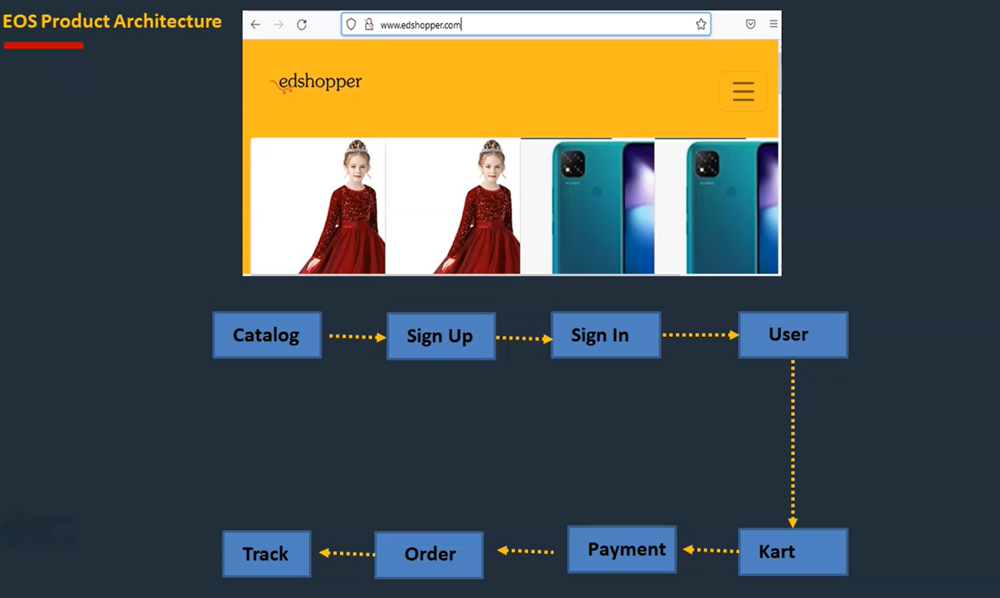
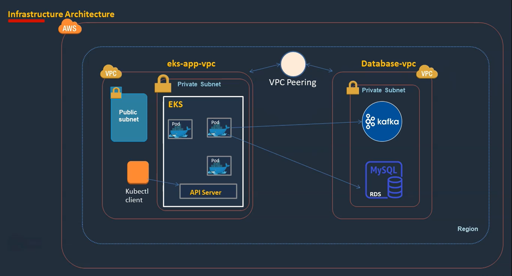
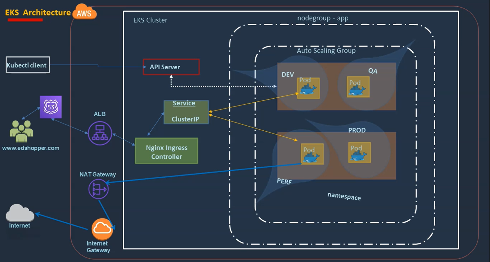
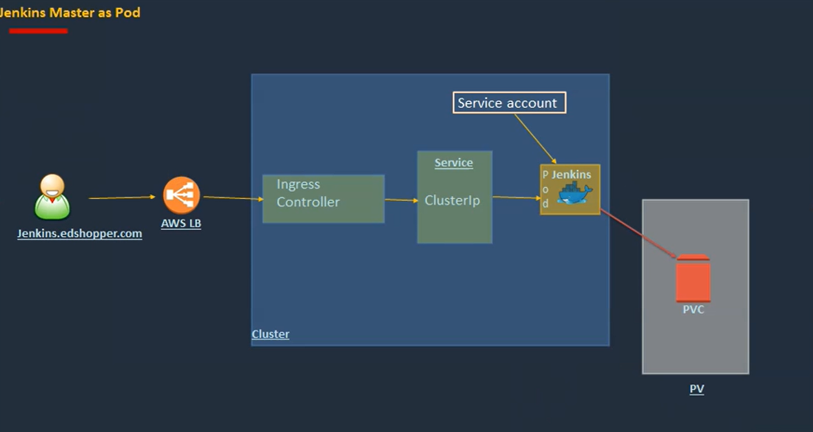
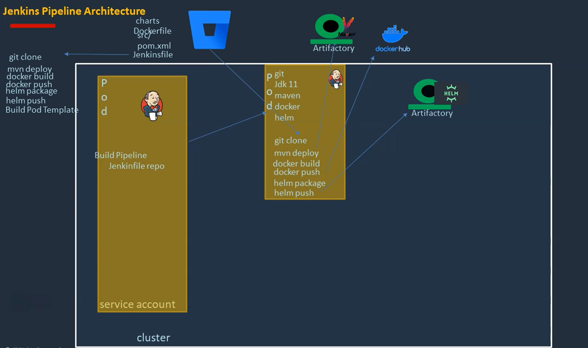

# Plateform Setup for the Project

Setting up a platform for the project involves creating an environment where development, testing, deployment, and monitoring processes can be efficiently managed. Below are tools and services that will be used by the project.

 

# VPC
I will be creating 2 VPCs. One for `EKS CLuster` and other for `Kafka and RDS Database`. By dividing infrastructure into separate VPCs can achieve enhanced security, scalability, and manageability. Each VPC operates independently, facilitating the deployment of diverse applications while maintaining isolation and compliance with specific network and security requirements. Additionally, VPC connectivity options like `VPC Peering`  enable seamless communication between VPCs, facilitating inter-service communication and resource sharing across the platform.

# EKS Cluster
Microservices of the project are deployed in an Amazon Elastic Kubernetes Service (EKS) cluster to leverage the scalability, resilience, and flexibility of container orchestration. EKS provides a managed Kubernetes environment within a Virtual Private Cloud (VPC), enabling seamless deployment, scaling, and management of microservices-based applications. Each microservice is containerized using Docker and deployed as a Kubernetes pod within the EKS cluster. Kubernetes resources such as Deployments, Services, and Ingresses are used to define, expose, and manage the microservices. By leveraging EKS, organizations can achieve efficient resource utilization, high availability, and automated deployment workflows for their microservices architecture.

# Jenkins Master as Pod

Jenkins Master has been deployed as a pod in an Amazon Elastic Kubernetes Service (EKS) cluster, leveraging the scalability and resilience of Kubernetes for continuous integration and continuous delivery (CI/CD) workflows. By containerizing Jenkins Master using Docker and defining it as a Kubernetes deployment, organizations can benefit from dynamic scaling, automated updates, and seamless integration with other Kubernetes resources. Persistent volumes has been used to store Jenkins configuration, job data, and plugins, ensuring data persistence and resilience. Additionally, Kubernetes features such as Service and Ingress  utilized to expose Jenkins services internally or externally, facilitating access and communication with Jenkins Master from other components of the CI/CD pipeline.

# Jenkins Agent as Dynamic Docker Container
Since Jenkins Master is associated with `Webhooks`, It triggers the CI pipeline upon each commit wherein the Jenkins Agent which is responsible for executing the job, is dynamically created along with the required packages defined in Dockerfile. As soon as the job completes, the Jenkins Agent Pod is automatically terminated, releasing resources it has consumed, ensuring efficient utilization of the resources.

